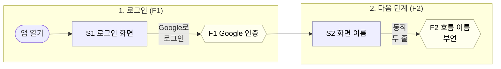

# Figma 유저플로우 export 가이드

작성일: 2026-09-07
검증 프로젝트: 식사 룰렛 (lunch-roulette)

앱의 유저플로우를 Figma MCP로 뽑아내는 절차다. 결과물은 두 가지다.

| 결과물 | 도구 | 산출 예 |
|---|---|---|
| A. FigJam 다이어그램 | `generate_diagram` (Mermaid) | https://www.figma.com/board/TYKrI6JL3kwlVwbXDZyTXL |
| B. Figma Design 화면 캡처 플로우 | Chrome 캡처 + `create_new_file` + `upload_assets` + `use_figma` | https://www.figma.com/design/swDjWYtHqtZzFEZmw31mdW |

다른 서비스에 적용할 때는 2장의 입력 파일을 그 서비스의 대응물로 바꾸고, 4장과 5장의 절차를 그대로 따른다.

---

## 1. 사전 조건

- Figma MCP 등록: `claude mcp add --transport http figma https://mcp.figma.com/mcp` (프로젝트 전용은 기본, 전역은 `-s user`). 첫 호출에서 브라우저 로그인 승인.
- 호출 한도 확인: Starter 플랜 View 시트는 읽기 도구 **월 20회**. `create_new_file`, `whoami`는 한도 제외. 다이어그램 1장 = 1회, 이미지 업로드 1회, `use_figma` 스크립트 1회씩 센다. 시작 전에 예산을 잡는다(이번 프로젝트: 다이어그램 5 + 업로드 1 + 스크립트 3 = 9회).
- planKey: `whoami`로 받는다. 플랜이 하나면 그 `key`를 그대로 쓴다.
- B 결과물에는 Chrome 확장(claude-in-chrome)과 배포된 앱, 로그인된 브라우저 세션이 필요하다.

---

## 2. 입력 파일 (이번에 참고한 것과 다른 서비스에서의 대응물)

| 역할 | 이번 프로젝트 파일 | 다른 서비스에서 준비할 것 |
|---|---|---|
| 플로우 원본 (Mermaid) | `docs/superpowers/specs/2026-09-04-lunch-roulette/14-userflow-happy-case.md` | 해피케이스 시나리오 + Mermaid 플로우차트 + 상태 전이. **이 파일이 source of truth**, Figma는 결과물 |
| 화면 정의 (S 번호) | `07-screens.md` | 화면 목록과 화면별 상태 표. 번호(S1, S2…)를 여기서 정한다 |
| 흐름 정의 (F 번호) | `06-flows.md` | 서버/비즈니스 흐름 목록. 번호(F1, F2…)를 여기서 정한다 |
| 도메인 규칙 | `05-rules.md` | 범례에 넣을 규칙(레벨, 상태, 슬롯 같은 것) |
| 인수인계/다음 할 일 | `docs/superpowers/handoff/…` | 진행 순서와 결정 기록 |
| 레이아웃 폭 | `src/app/globals.css` (`max-width: 480px`), `layout.tsx` | 캡처 영역을 정하기 위한 본문 폭 |
| 확정/삭제 확인 방식 | `src/app/components/RouletteBoard.tsx` | `window.confirm` 같은 브라우저 기본 창을 쓰는지. 기본 창이면 브라우저 자동화가 멈춘다 |
| 하단 내비 구성 | `src/app/components/Nav.tsx` | 화면 간 이동 경로 |
| 기존 스크린샷 | `docs/superpowers/reviews/2026-09-04-visual-design/*.png` | 로그인 화면처럼 자동화로 찍기 어려운 화면의 대체 후보 |

번호 규칙: **모든 노드 제목과 화살표 라벨은 문서의 번호(S1, F4)로 시작**한다. 번호로 문서를 찾는다. 번호가 없는 상태(애니메이션, 확정 확인 같은 화면 안 상태)는 "S2 홈 · 후보 카드 3장"처럼 화면 번호 뒤에 상태를 붙인다.

### 2-1. 입력 파일이 없을 때 만드는 순서

다른 서비스에는 위 문서가 없는 경우가 보통이다. 최소한 아래 세 파일을 먼저 만든다. 코드나 실제 앱에서 뽑아내며, 각각 30분 안에 끝나는 분량으로 잡는다. 이 세 파일이 있어야 4장과 5장이 그대로 돌아간다.

**순서**

1. 화면 목록(S)을 만든다. 라우트 파일이나 실제 앱을 돌며 사용자가 보는 화면을 세고 번호를 붙인다.
2. 흐름 목록(F)을 만든다. 서버 액션, API 핸들러, 상태를 바꾸는 함수를 세고 번호를 붙인다.
3. 해피케이스 문서를 만든다. 시나리오를 번호 단계로 쓰고, 그 단계를 Mermaid로 옮긴다.
4. 규칙이 있으면(레벨, 등급, 상태 머신) 범례용으로 한 표에 모은다. 없으면 생략한다.

**어디서 뽑는가**

| 만들 것 | 코드에서 | 실행 중인 앱에서 |
|---|---|---|
| 화면 목록 | 라우트 디렉터리(`src/app/**/page.tsx`, `pages/`, `routes/`), 내비게이션 컴포넌트 | 하단 탭·메뉴를 전부 눌러 보며 URL을 적는다 |
| 화면별 상태 | 화면 컴포넌트의 조건 분기(`if (state === ...)`, 로딩·빈 목록·오류 분기) | 같은 화면에서 데이터 유무, 진행 중, 완료 상태를 만들어 본다 |
| 흐름 목록 | `actions/`, `api/`, `services/`, 폼 `action=`, `onClick` 핸들러가 부르는 함수 | 버튼을 누를 때 서버에 무엇이 저장되는지 네트워크 탭에서 본다 |
| 확인 창 방식 | `window.confirm`, `alert` grep | 삭제·확정 버튼을 눌러 브라우저 기본 창이 뜨는지 본다 (자동화 전에 반드시) |
| 본문 폭 | 전역 CSS의 `max-width`, 레이아웃 컨테이너 | 창을 넓혀 보고 본문이 가운데 고정되는지 본다 |
| 규칙 | `rules/`, `constants/`, 레벨·상태 enum | 화면에 보이는 배지·등급 문구 |

**템플릿 1: 화면 목록 (`screens.md`)**

```markdown
# 화면

| 번호 | 이름 | URL | 무엇이 보이나 (한 줄) |
|---|---|---|---|
| S1 | 로그인 | /login | 로그인 버튼 하나 |
| S2 | 홈 | / | 핵심 동작 버튼과 결과 영역 |
| S3 | 설정 | /settings | 목록과 추가 폼 |

## S2 홈 상태별 표시

| 상태 | 표시 | 버튼 |
|---|---|---|
| 데이터 없음 | 안내 문구 | 주 버튼 활성 |
| 진행 중 | 후보 목록 | 확정, 다시 |
| 완료 | 결과 카드 | 없음 |
```

**템플릿 2: 흐름 목록 (`flows.md`)**

```markdown
# 흐름

| 번호 | 이름 | 트리거(화면·버튼) | 서버가 하는 일 (한 줄) | 결과 화면 |
|---|---|---|---|---|
| F1 | 로그인 | S1 로그인 버튼 | 인증 후 세션 발급 | S2 |
| F2 | 항목 생성 | S3 추가 폼 | 검증 후 저장 | S3 |
| F3 | 실행 | S2 주 버튼 | 후보 계산, 진행 중 상태 저장 | S2 진행 중 |
| F4 | 확정 | S2 후보 탭 | 상태를 완료로 바꾸고 기록 | S2 완료 |

해피케이스에 나오지 않는 흐름: F5 삭제, F6 만료.
```

**템플릿 3: 해피케이스 (`userflow-happy-case.md`)**

```markdown
# 유저플로우 해피케이스

이 파일의 Mermaid가 원본이다. Figma는 결과물이다. 흐름을 바꾸면 이 파일을 먼저 고친다.

FigJam 보드: (절차 A 결과 URL)
Figma Design: (절차 B 결과 URL)

## 등장 요소

| 종류 | 번호 | 이름 | 한 줄 설명 | 정의 문서 |
|---|---|---|---|---|
| 화면 | S1 | 로그인 | … | screens.md |
| 흐름 | F1 | 로그인 | … | flows.md |

## 시나리오

1. 앱을 연다. S1이 보인다.
2. 로그인 버튼을 누른다. (F1) S2로 이동.
3. …

## 다이어그램

(3장 템플릿의 Mermaid. 시나리오 단계 하나가 subgraph 하나)

## 화면 상태 전이 (S2)

stateDiagram-v2로 S2의 상태만 그린다.
```

**캡처 목록은 시나리오에서 바로 나온다.** 시나리오 각 단계에서 "사용자가 보는 화면"을 하나씩 뽑으면 5-1의 표가 된다. 단계가 화면 안 상태 변화(애니메이션, 확인 창)면 그것도 한 장으로 센다.

문서가 전혀 없고 시간이 없으면 최소 구성은 이것이다: 화면 표(S)와 흐름 표(F) 각 하나, 시나리오 번호 목록, Mermaid 하나. 범례와 상태 전이는 나중에 붙여도 된다.

---

## 3. 문서 쪽 준비 (Mermaid 원본 작성 규칙)

`generate_diagram`이 받아들이는 Mermaid 규칙이다. 원본 문서의 Mermaid를 처음부터 이 규칙으로 쓰면 그대로 넘길 수 있다.

- `flowchart LR` 가로 방향. 세로(TD)는 노드가 많으면 읽기 어렵다.
- 시나리오 단계별로 `subgraph`를 만든다(예: 1. 로그인, 2. 장소 등록, 3. 돌리기, 4. 확정, 5. 기록). 각 subgraph 안에 `direction LR`.
- 노드와 화살표 텍스트는 **전부 따옴표**로 감싼다: `S1["S1 로그인 화면"]`, `-->|"돌리기"|`.
- 화살표 라벨이 길면 `<br/>`로 두 줄로 나눈다. 안 나누면 라벨이 화살표를 덮어 화살표가 안 보인다. `\n`은 쓰지 않는다.
- 이모지는 쓰지 않는다.
- 화면은 사각형 `[" "]`, 서버 흐름은 육각형 `{{" "}}`, 시작/끝은 `([" "])`, 선택 경로는 점선 `-.->`.
- classDef로 색을 준다. 화면 파랑(`#eef`/`#88a`), 흐름 노랑(`#ffe`/`#aa8`), 상태 흰색(`#fff`/`#999`).
- 범례 다이어그램을 따로 만든다. subgraph 4개(화면, 서버 흐름, 규칙, 해피케이스 제외 항목)에 화살표 없이 노드만 둔다.

템플릿:



---

## 4. 절차 A: FigJam 다이어그램

1. `whoami`로 planKey를 얻는다.
2. `generate_diagram`에 Mermaid를 그대로 넘긴다. `create_new_file`은 부르지 않는다. 이 도구가 파일을 직접 만든다.
3. 첫 호출 결과의 board URL에서 fileKey(`figma.com/board/{fileKey}`)를 얻어, 이후 다이어그램(상태 전이, 범례)은 `fileKey`를 줘서 같은 보드에 추가한다.
4. 결과 URL을 원본 문서(스펙 14 상단)에 적는다.

함정:

- 이 도구는 **기존 도형을 수정·삭제하지 못한다**. 고칠 때는 새로 그려지고 옛 버전이 남는다. 옛 버전 삭제는 사용자가 FigJam에서 직접 한다.
- 도형 간격이나 화살표 길이는 조정할 수 없다. 자동 배치뿐이다. 라벨 줄바꿈으로 해결한다.
- 한 번 그릴 때마다 한도 1회다. 방향, 섹션, 줄바꿈, 범례를 처음부터 넣어서 한 번에 끝내는 게 이득이다(이번에는 4번 다시 그렸다).

---

## 5. 절차 B: Figma Design 화면 캡처 플로우

### 5-1. 캡처할 화면 목록 정하기

해피케이스 시나리오의 각 단계에서 사용자가 보는 화면을 하나씩 정한다. 이번 프로젝트의 9장:

| 순서 | 파일명 | 화면 | 얻는 방법 |
|---|---|---|---|
| 01 | `01-S1-login.png` | 로그인 | 로그아웃 상태에서 홈 접속 |
| 02 | `03-S3-places.png` | 장소 관리 | `/places` |
| 03 | `04-S3-place-detail.png` | 장소 상세 | 장소 이름 클릭 |
| 04 | `02-S2-home-idle.png` | 홈, 세션 없음 | `/` |
| 05 | `05-S2-home-spinning.png` | 룰렛 애니메이션 | 돌리기 클릭 후 4초 안에 스크린샷 |
| 06 | `06-S2-home-open.png` | 후보 카드 3장 | 애니메이션 종료 후 |
| 07 | `07-S2-home-confirm-ask.png` | 확정 확인 | 카드 클릭 |
| 08 | `08-S2-home-confirmed.png` | 확정 결과 | 확정 클릭, 3초 대기 |
| 09 | `09-S4-records.png` | 기록 | `/records` |

파일명 규칙: `순번-화면번호-상태.png`. 업로드할 때 파일명이 Figma 레이어 이름이 된다.

### 5-2. 캡처 방법 (claude-in-chrome)

- 로그인, 결제, OAuth 동의는 사용자가 직접 한다. 로그아웃 상태 화면이 필요하면 사용자에게 로그아웃을 부탁하고 찍은 뒤 다시 로그인을 부탁한다.
- 데이터가 바뀌는 동작(이번의 돌리기·확정)은 실행 전에 사용자 확인을 받는다. 되돌리는 방법(관리자 초기화 버튼 등)을 함께 말한다.
- `computer.screenshot`은 창 크기와 무관하게 약 1528×784로 온다. `resize_window`로 폭을 줄여도 스크린샷 크기는 안 바뀐다.
- 앱 본문이 가운데 고정폭 컬럼이면 `computer.zoom`으로 그 컬럼만 잘라 저장한다. 480px 컬럼이 1528 폭 가운데에 있으면 region은 `[524, 0, 1004, 784]`. 세로 스크롤바가 생기면 컬럼이 왼쪽으로 몇 px 밀리니 스크린샷을 보고 region을 다시 잰다.
- `save_to_disk: true`로 저장하고 스크래치패드로 복사해 파일명을 붙인다.
- zoom 전에 마우스를 컬럼 밖으로 `hover` 시킨다. 안 그러면 커서가 캡처에 찍힌다(이번 04번 캡처에 찍혔다).
- 애니메이션처럼 짧은 상태는 `browser_batch`로 클릭 → wait → screenshot을 한 번에 보낸다. 놓치면 그 전체 스크린샷(jpg)을 나중에 잘라 쓴다. Python PIL이 없으면 PowerShell `System.Drawing`으로 자른다.
- 페이지가 뷰포트보다 길면 스크롤해서 여러 장을 찍는다. 이번에는 전부 한 화면에 들어갔다.
- 브라우저 기본 `confirm()`/`alert()`를 쓰는 버튼은 누르지 않는다. 자동화가 멈춘다. 코드로 먼저 확인한다.

### 5-3. Figma 파일 생성과 업로드

1. `create_new_file` (editorType `design`, planKey, 파일 이름). 한도 제외.
2. `upload_assets` (fileKey, count = 이미지 수). 업로드 URL을 받는다. 한도 1회.
3. 각 URL에 multipart로 POST한다. 파일명이 레이어 이름이 된다.

```bash
curl -s -X POST -F "file=@01-S1-login.png;type=image/png" "<submitUrl>"
# 응답: {"success":true,"imageHash":"…","placedOnNodeId":"1:2"}
```

4. 응답의 `placedOnNodeId`를 순서대로 기록한다. 배치 스크립트에서 이 id로 노드를 찾는다.

주의: 업로드로 생긴 프레임은 **원본 비율이 아니다**. 스크립트에서 비율을 다시 맞춘다(5-4 스크립트 2).

### 5-4. 배치 스크립트 (`use_figma`)

호출 전에 figma-use 스킬(`skill://figma/figma-use/SKILL.md`)을 읽는다. 핵심 규칙: 색은 0~1, 텍스트는 `loadFontAsync` 후 수정, `return`으로 결과 반환, 생성/수정한 노드 id를 전부 반환, 새 노드는 원점에서 떨어뜨린다.

스크립트 1: 가로 배치 + 제목/설명 + 화살표. `order`의 id와 문구, `arrows`만 바꾸면 된다.

```js
const REG = { family: "Inter", style: "Regular" }, BOLD = { family: "Inter", style: "Bold" };
await Promise.all([figma.loadFontAsync(REG), figma.loadFontAsync(BOLD)]);
const W = 390, GAP = 170, X0 = 120, Y = 320;
const order = [ { id: "1:2", title: "① S1 로그인", cap: "설명" }, /* … */ ];
const arrows = [ "Google로 로그인\nF1 Google 인증", /* order.length - 1 개 */ ];
const created = [];
function text(str, x, y, size, font, width, align) {
  const t = figma.createText(); t.fontName = font; t.characters = str; t.fontSize = size;
  t.fills = [{ type: "SOLID", color: { r: 0.1, g: 0.1, b: 0.1 } }];
  if (width) { t.textAutoResize = "HEIGHT"; t.resize(width, 10); }
  if (align) t.textAlignHorizontal = align;
  t.x = x; t.y = y; figma.currentPage.appendChild(t); created.push(t.id); return t;
}
text("서비스명 · 유저플로우 해피케이스 (프로덕션 캡처, 날짜)", X0, 140, 32, BOLD);
const pos = [];
for (let i = 0; i < order.length; i++) {
  const n = await figma.getNodeByIdAsync(order[i].id);
  n.x = X0 + i * (W + GAP); n.y = Y; n.name = order[i].title;
  n.cornerRadius = 12; n.strokeWeight = 1;
  n.strokes = [{ type: "SOLID", color: { r: 0.85, g: 0.85, b: 0.85 } }];
  n.effects = [{ type: "DROP_SHADOW", color: { r: 0, g: 0, b: 0, a: 0.12 }, offset: { x: 0, y: 4 }, radius: 16, visible: true, blendMode: "NORMAL" }];
  pos.push(n.x);
  text(order[i].title, n.x, Y - 48, 20, BOLD, W);
}
for (let i = 0; i < arrows.length; i++) {
  const ax = pos[i] + W + 25;
  const a = figma.createNodeFromSvg('<svg width="120" height="20" viewBox="0 0 120 20" xmlns="http://www.w3.org/2000/svg"><path d="M2 10 H108" stroke="#D32F2F" stroke-width="3" stroke-linecap="round"/><path d="M100 3 L112 10 L100 17" stroke="#D32F2F" stroke-width="3" fill="none" stroke-linecap="round" stroke-linejoin="round"/></svg>');
  a.x = ax; a.y = Y + 300; figma.currentPage.appendChild(a); created.push(a.id);
  const l = text(arrows[i], ax - 20, Y + 240, 13, BOLD, 160, "CENTER");
  l.fills = [{ type: "SOLID", color: { r: 0.83, g: 0.18, b: 0.18 } }];
}
return { createdNodeIds: created };
```

스크립트 2: 비율 복구 + 설명 배치 + 단계별 섹션. 캡처 원본 픽셀 크기(`aspects`)를 넣는다. 설명 텍스트는 비율을 맞춘 뒤 `Y + 높이 + 16`에 둔다.

```js
const W = 390, Y = 320, PAD = 40;
const aspects = { "1:2": 1398 / 827 };          // 예외 비율만 적고 나머지는 기본값
const DEFAULT = 1314 / 806;
const screens = ["1:2", "1:4", /* 순서대로 */];
const caps = { "1:2": "설명", /* … */ };
const groups = [ { name: "1. 로그인 (F1)", idx: [0] }, { name: "2. …", idx: [1, 2] } ];
const REG = { family: "Inter", style: "Regular" }; await figma.loadFontAsync(REG);
const page = figma.currentPage, ids = [], info = []; let maxH = 0;
for (const id of screens) {
  const n = await figma.getNodeByIdAsync(id);
  const hh = Math.round(W * (aspects[id] || DEFAULT));
  n.resize(W, hh);
  n.fills = n.fills.map(f => f.type === "IMAGE" ? { ...f, scaleMode: "FIT" } : f);
  const t = figma.createText(); t.fontName = REG; t.characters = caps[id]; t.fontSize = 13;
  t.textAutoResize = "HEIGHT"; t.resize(W, 10); t.x = n.x; t.y = Y + hh + 16; page.appendChild(t);
  info.push({ x: n.x, h: hh }); maxH = Math.max(maxH, hh); ids.push(id, t.id);
}
const bottom = Y + maxH + 16 + 110 + PAD;
const children = [...page.children].filter(c => c.type !== "SECTION" && c.y > 200);
for (const g of groups) {
  const sx = info[g.idx[0]].x - PAD, ex = info[g.idx[g.idx.length - 1]].x + W + PAD;
  const sec = figma.createSection(); sec.name = g.name; sec.x = sx; sec.y = Y - 110;
  sec.resizeWithoutConstraints(ex - sx, bottom - (Y - 110));
  sec.fills = [{ type: "SOLID", color: { r: 0.97, g: 0.96, b: 0.95 } }];
  page.appendChild(sec);
  for (const c of children) {
    const cx = c.x + c.width / 2;
    if (cx >= sx && cx <= ex) { const ax = c.x, ay = c.y; sec.appendChild(c); c.x = ax - sec.x; c.y = ay - sec.y; }
  }
  ids.push(sec.id);
}
const shot = await (await figma.getNodeByIdAsync(ids[ids.length - 1])).screenshot();
return { mutatedNodeIds: ids, shot };
```

스크립트 3: 범례 패널. 오토레이아웃 세로 패널 안에 가로 컬럼 3개(화면, 서버 흐름, 규칙·비고). 각 컬럼은 세로 오토레이아웃에 제목 + [번호, 설명] 행. 행은 가로 오토레이아웃, 번호 폭 150, 설명 폭 300, `textAutoResize = "HEIGHT"`. 위치는 섹션 아래(`y = bottom + 80`). 마지막에 `await panel.screenshot()`으로 확인한다.

### 5-5. 검증

- 스크립트마다 `screenshot()`을 반환해 눈으로 확인한다. 잘린 텍스트, 겹침, 비율 깨짐을 본다.
- 첫 배치 후 `maxH`가 이미지 비율과 안 맞으면(이번엔 293이 나와 잘못을 알았다) 스크립트 2로 고친다.
- 커서가 찍힌 캡처, 로딩 중 캡처는 다시 찍는다.

---

## 6. 산출물 기록

- 원본 문서(스펙 14) 상단에 FigJam 보드와 Design 파일 URL을 적는다. "이 문서가 원본, Figma는 결과물" 문장을 유지한다.
- 인수인계 문서의 다음 할 일에 완료 표시와 URL.
- 메모리(프로젝트 상태)에 URL, 사용한 한도, 캡처 방법의 특이점.
- 캡처 원본 png는 세션 스크래치패드에만 남는다. 보관하려면 `docs/figma/captures/`로 옮긴다.

---

## 7. 체크리스트

- [ ] Figma MCP 연결, `whoami`로 planKey 확인, 남은 한도 계산
- [ ] 화면 번호(S)와 흐름 번호(F)가 문서에 정의돼 있음. 없으면 2-1의 템플릿 3개로 먼저 만든다
- [ ] Mermaid: LR, subgraph 단계, 따옴표, `<br/>` 줄바꿈, classDef, 범례
- [ ] `generate_diagram` 플로우차트 → 같은 fileKey로 상태 전이·범례
- [ ] 캡처 목록과 파일명 확정, 데이터 변경 동작은 사용자 확인
- [ ] 브라우저 기본 confirm/alert 사용 여부 코드 확인
- [ ] 캡처: hover로 커서 치우기 → zoom region → save_to_disk → 파일명 부여
- [ ] `create_new_file`(design) → `upload_assets` → curl multipart → placedOnNodeId 기록
- [ ] 스크립트 1 배치 → 스크립트 2 비율·섹션 → 스크립트 3 범례, 각각 screenshot 확인
- [ ] 문서·인수인계·메모리에 URL 기록, 옛 FigJam 버전 삭제는 사용자에게
