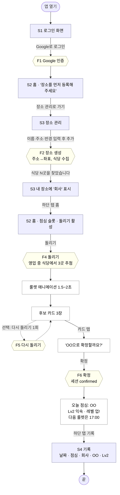
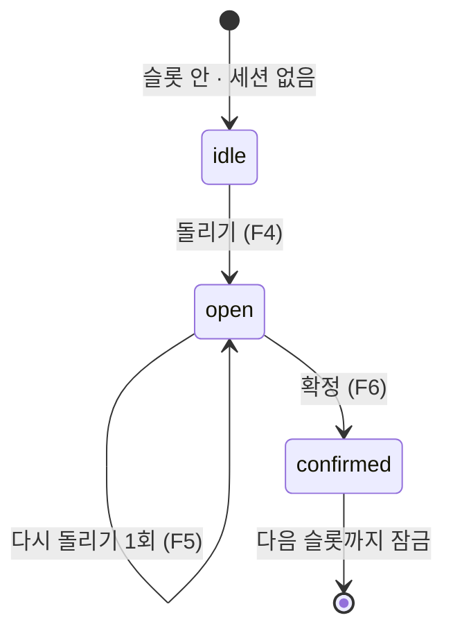

# 14. 유저플로우 해피케이스

[← 인덱스](README.md)

사용자가 아무 문제 없이 앱을 처음 쓰기 시작해 식사 한 끼를 확정하고 기록으로 남기기까지의 흐름이다.
오류와 예외 분기는 다루지 않는다. 그것은 [06-flows.md](06-flows.md)와 [08-errors.md](08-errors.md)에 있다.

이 파일의 Mermaid 다이어그램이 원본이다. Figma(FigJam)에는 이 다이어그램을 렌더한 SVG를 가져다 쓴다.
흐름을 바꿀 때는 이 파일을 먼저 고치고 FigJam을 다시 가져온다. 렌더 방법은 맨 아래에 있다.

## 등장 요소

| 종류 | 번호 | 이름 | 정의 문서 |
|---|---|---|---|
| 화면 | S1 | 로그인 | [07-screens.md](07-screens.md) |
| 화면 | S2 | 홈(룰렛) | 07 |
| 화면 | S3 | 장소 관리 | 07 |
| 화면 | S4 | 기록 | 07 |
| 흐름 | F1 | 로그인 | [06-flows.md](06-flows.md) |
| 흐름 | F2 | 장소 생성 | 06 |
| 흐름 | F4 | 돌리기 | 06 |
| 흐름 | F5 | 다시 돌리기 (선택) | 06 |
| 흐름 | F6 | 확정 | 06 |
| 흐름 | F8 | 기록과 레벨 조회 | 06 |

F3(장소 삭제)과 F7(만료)은 해피케이스에 나오지 않는다.

## 시나리오

첫 사용자가 점심시간에 앱을 열어 회사 근처 식당 하나를 확정한다.

1. 앱을 연다. 로그인 전이라 S1 로그인 화면이 보인다.
2. "Google로 로그인"을 누르고 Google 계정을 고른다. (F1)
3. 로그인 후 S2 홈이 열리는데 장소가 없어 "장소를 먼저 등록해 주세요"와 "장소 관리로 가기" 링크만 보인다. 링크를 눌러 S3 장소 관리로 간다. 이름 "회사", 주소, 반경 500m(기본값)를 넣고 "추가"를 누른다.
4. 서버가 주소를 좌표로 바꾸고 반경 안 식당을 수집한다. "장소를 추가했습니다. 식당 N곳을 찾았습니다"가 보인다. (F2)
5. 하단 탭 "홈"으로 간다. 장소 드롭다운에 "회사"가 선택돼 있고 "오늘 점심" 아래 "돌리기" 버튼이 활성이다. (S2)
6. "돌리기"를 누른다. 서버가 영업 중인 식당에서 3곳을 뽑아 세션을 연다. 룰렛 애니메이션이 1.5~2초 돌고 후보 카드 3장이 나온다. (F4)
7. (선택) 마음에 안 들면 "다시 돌리기"를 한 번 누른다. 후보 3장이 바뀌고 버튼은 비활성이 된다. (F5)
8. 후보 카드 하나를 누른다. "OO으로 확정할까요?"가 뜨고 "확정"을 누른다. (F6)
9. 화면이 "오늘 점심: OO"으로 바뀌고 레벨 배지가 "Lv2 익숙", "레벨 업!"이 보인다. 첫 방문이라 Lv1에서 Lv2로 오른 것이다. "다음 룰렛은 17:00에 열립니다"가 함께 보인다.
10. 하단 탭 "기록"으로 간다. 오늘 날짜, 점심, 회사, 식당 이름, "Lv2 익숙"이 한 줄로 보인다. (S4, F8)

## 다이어그램



범례: 파란 사각형은 화면(S), 노란 육각형은 서버 흐름(F), 흰 사각형은 화면 안의 상태다. 점선은 선택 경로다.

## 화면 상태 전이 (S2 홈)

해피케이스에서 홈 화면이 거치는 상태다. 상태 정의는 [05-rules.md](05-rules.md) 세션 상태 표를 따른다.



## 문서와 Figma 연결 규칙

- FigJam의 각 노드 제목은 이 문서의 번호(S1, F4 등)로 시작한다. 번호로 문서를 찾는다.
- FigJam에서 흐름을 고치고 싶으면 이 파일의 Mermaid를 먼저 고치고 다시 렌더한다. FigJam은 결과물이다.
- 화면 디자인이 생기면(백로그 Q2) FigJam의 S 노드에서 디자인 파일의 프레임으로 링크를 건다.

## 렌더 방법

```
npx --yes @mermaid-js/mermaid-cli -i docs/superpowers/specs/2026-09-04-lunch-roulette/14-userflow-happy-case.md -o docs/figma/userflow-happy-case.svg
```

- 결과는 `docs/figma/` 아래에 SVG로 저장한다. 다이어그램이 두 개라 파일이 두 개(`-1.svg`, `-2.svg`)로 나온다.
- FigJam에서 파일 → 가져오기(또는 드래그 앤 드롭)로 SVG를 넣는다. 편집 가능한 도형이 필요하면 FigJam의 Mermaid 가져오기 플러그인에 위 코드 블록을 붙여 넣는다.
